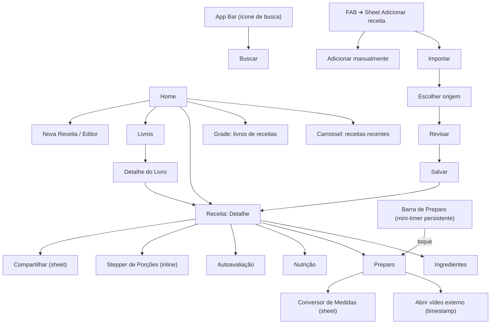
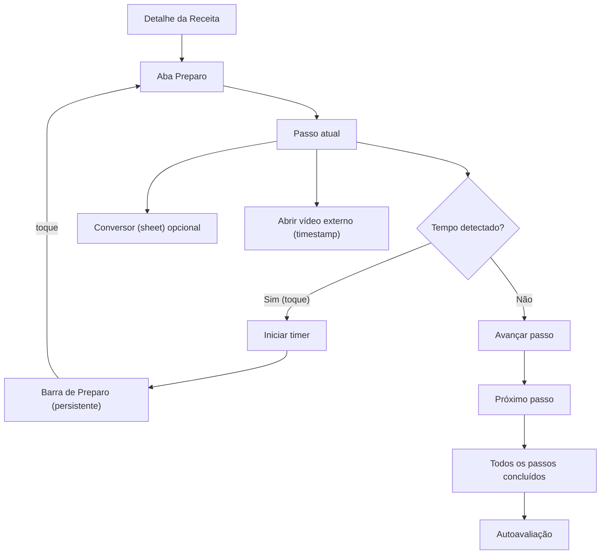
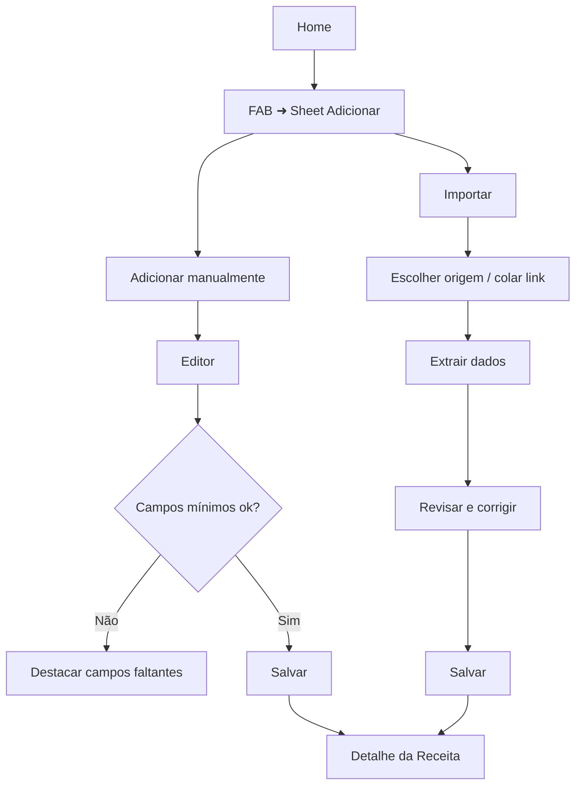

# Cookzy — Especificação de UI/UX

## Introdução

Este documento define os objetivos de experiência do usuário, a arquitetura da informação, os fluxos de usuário e as especificações de design visual para a interface do Cookzy. Ele serve como base para o design visual e o desenvolvimento frontend, garantindo uma experiência coesa e centrada no usuário.

> Observação: cores, tema e tipografia são definidos no código do app e serão referenciados nas seções de Branding & Estilo e Tipografia para manter alinhamento com Material 3.

## Change Log

| Date       | Version | Description                                              | Author      |
|------------|---------|----------------------------------------------------------|-------------|
| 2025-10-21 | 0.1     | Documento iniciado; propósito e escopo definidos         | Sally (UX)  |
| 2025-10-21 | 0.2     | IA refinada e navegação consolidadas com decisões do time | Sally (UX)  |
| 2025-10-21 | 0.3     | Adicionados fluxos de usuário: Cozinhar e Criar Receita   | Sally (UX)  |
| 2025-10-21 | 0.4     | Preparo sem player interno; abrir vídeo externo com timestamp | Sally (UX)  |

## Objetivos e Princípios de UX

### Personas Alvo
- Cozinheiro do dia a dia: cozinha regularmente; prioriza simplicidade, busca eficiente, coleções e timers.
- Iniciante/Estudante: necessita de orientação clara, validações e feedback; segue vídeos passo a passo.
- Entusiasta avançado: importa de YouTube/TikTok, organiza coleções, ajusta porções e nutrição com eficiência.

### Metas de Usabilidade
- Aprendizado: criar e salvar uma receita em ≤ 5 minutos.
- Eficiência: iniciar um timer a partir de um passo em ≤ 2 toques.
- Escalonamento: ajustar porções e visualizar nutrição em ≤ 3 toques.
- Prevenção de erros: confirmações/desfazer para ações destrutivas; validações claras.
- Memorabilidade: retomar o preparo de onde parou (estado preservado).

### Princípios de Design
- Clareza acima de esperteza.
- Divulgação progressiva.
- Padrões consistentes (Material 3, Compose).
- Feedback imediato (timers, snackbars, estados de carregamento).
- Acessível por padrão.

## Arquitetura da Informação (IA)

### Site Map / Inventário de Telas

### Estrutura de Navegação

- Primária: App Bar (sem Bottom Bar) com ícone/campo de busca nas telas principais; rotas empilhadas (Compose Navigation) a partir da Home para `recipe/{id}`, `book/{id}`, editor e busca.
- Ações globais: FAB abre bottom sheet “Adicionar receita” com opções Importar ou Adicionar manualmente.
- Secundária (por tela): abas em Detalhe da Receita (Ingredientes / Preparo / Nutrição); bottom sheets para Conversor de Medidas e Compartilhar; Escalonar Porções via Number Stepper inline na própria tela.
- Mini‑timer: exibido como “Barra de Preparo” persistente no rodapé enquanto um preparo está ativo; toque abre a tela de Preparo.
- Pós‑importação: redirecionar diretamente para a tela de Detalhe da receita salva.
- Tablet/Wide: manter layout de phone (sem Navigation Rail) neste MVP.
- Empty/Erro: telas ilustradas com CTA (“Criar primeira receita”, “Tentar de novo”, “Voltar”).
- Breadcrumb: não aplicável em mobile; utilizar Up/Back com preservação de estado.

## Fluxos de Usuário

### Cozinhar (Preparo passo a passo)

**Objetivo do Usuário:** concluir o preparo de uma receita com apoio de timers, vídeo e conversões sem perder o contexto.

**Pontos de Entrada:** Detalhe da Receita → aba Preparo; Barra de Preparo (mini‑timer persistente); notificação de término de timer; link externo para vídeo no timestamp (YouTube/Instagram);

**Critérios de Sucesso:** passos concluídos; timers iniciam/pausam/notificam; progresso preservado ao navegar/voltar; Barra de Preparo acessível em todo o app enquanto ativa.

**Edge Cases & Erros:**
- Múltiplos timers simultâneos (prioridade e agrupamento de notificações).
- Saída do app/lock de tela (preservar progresso/temporizadores).
- Permissões de notificação negadas (fallback visual/sonoro interno).
- Link/timestamp inválido ou app externo indisponível (oferecer abrir no navegador/copiar link; fallback para seguir apenas o texto do passo).
- Importações com passos sem tempo (esconder opção de timer nesse passo).
- Rotação/orientação: manter passo/scroll/aba corrente.

**Notas:** a “Barra de Preparo” é o handler visual do mini‑timer; tapping retorna à aba Preparo. Escalonar porções é feito via Stepper inline no Detalhe (não abre sheet).

### Criar Receita

**Objetivo do Usuário:** criar e salvar uma nova receita (manual ou a partir de importação) com campos mínimos para uso no preparo.

**Pontos de Entrada:** Home → FAB “Adicionar receita” (bottom sheet) → Importar ou Adicionar manualmente.

**Critérios de Sucesso:** receita salva aparece na Home/coleção; campos mínimos válidos; rascunho protegido contra perda acidental; redireciona ao Detalhe após salvar.

**Campos mínimos (sugeridos):** Título, ≥1 ingrediente, ≥1 passo do preparo.

**Edge Cases & Erros:**
- Perda de dados ao sair do Editor (autosave ou rascunho com confirmação ao descartar).
- Falha na importação (mensagem com opção de tentar novamente/editar manualmente).
- Duplicidade (detectar possível duplicata por título+origem; oferecer manter ambas/mesclar).
- Falha de rede durante extração (retry exponencial; permitir editar manualmente).
- Imagens/cover opcionais com permissões tratadas sob demanda.

**Notas:** editor segue Material 3; validação inline com mensagens claras. Após salvar (manual ou importado), redirecionar diretamente para o Detalhe.

## Wireframes & Mockups

**Arquivos de design:** Figma — definir link posteriormente

### Home
- Purpose: descoberta rápida (recentes) + acesso a livros
- Key Elements: App Bar com busca; carrossel “Receitas recentes” com 2 cards médios por viewport (peek visível); grade “Livros” em 2 colunas (phone); FAB “Adicionar receita”.
- Interaction Notes: FAB abre sheet (Importar/Manual); cartões mostram cover, tempo e tags; estados vazio/erro/skeleton.

### FAB Sheet — Adicionar receita
- Purpose: criar por importação ou manual
- Key Elements: lista com opções e ícones (YouTube/Instagram/Link genérico, Manual); descrição curta por item.
- Interaction Notes: 48dp touch targets; foco inicial no primeiro item; suporte a teclado.

### Detalhe da Receita
- Purpose: centro de verdade da receita
- Key Elements: título; botão “Iniciar preparo”; botão “Medidas” (abre Conversor como sheet); Stepper de porções inline posicionado abaixo do “Iniciar preparo” e ao lado do botão “Medidas”; tabs (Ingredientes/Preparo/Nutrição); botão “Compartilhar”; CTA “Abrir vídeo externo (timestamp)” abaixo do título quando houver origem de vídeo.
- Interaction Notes: Stepper com faixa 1–99 (passo 1), persistido por receita; recalcula quantidades em Ingredientes; Compartilhar abre sheet; voltar mantém rolagem/aba ativa.

### Preparo
- Purpose: executar passo a passo com foco
- Key Elements: passo atual em destaque; botão Iniciar/Pausar timer quando houver tempo; botão “Concluir passo” para avançar; prévia (1 linha) do próximo passo; Conversor (sheet); CTA “Abrir vídeo externo (timestamp)” ao final do texto do passo; Barra de Preparo fixa no rodapé (título curto + tempo restante + play/pause + fechar).
- Interaction Notes: barra persiste em todo o app enquanto ativa; tap abre Preparo; swipe para dispensar (confirmar se timer ativo); timers continuam em background com notificação.

### Buscar
- Purpose: localizar receitas rapidamente
- Key Elements: campo/ícone de busca na App Bar; sugestões; chips de filtro (tempo, livro, tag); lista de resultados.
- Interaction Notes: debounce na digitação; histórico recente; estados vazio/erro/skeleton.

### Estados vazios/erro
- Home: ilustração + CTA “Criar primeira receita”.
- Buscar: ilustração + CTA “Tentar outra busca”.
- Livros: ilustração + CTA “Criar livro”.
- Importar: mensagens de falha com ação “Tentar novamente/Editar manualmente”.

### Notas gerais de UI
- Hierarquia visual: títulos fortes; ações primárias evidentes; espaçamento base 8dp.
- Consistência: reuso de cards, chips e cabeçalhos de sheet; Material 3 com tema/tipografia conforme código do app.
- A11y: alvos 48dp; contraste conforme tema; contentDescription; ordem de foco previsível; linhas 1.5–1.8 em passos.

## Component Library / Design System

**Design System Approach:** adotar Material 3 como base com tema/tipografia já definidos no código (`Theme.kt`, `Color.kt`, `Type.kt`), complementando com tokens específicos quando necessário (ex.: cores de sucesso via `ExtendedColorScheme`). Evitar criar um sistema paralelo; priorizar componentes Compose padrão com sobreposições leves.

Componentes nucleares (propostos):

1. App Bars
   - Purpose: navegação e busca
   - Variants: padrão; com campo de busca; com ações (Compartilhar)
   - States: padrão, scrolled, loading (skeleton do título)

2. FAB + Sheet "Adicionar receita"
   - Purpose: entrada para Importar/Manual
   - Variants: ícone + label; apenas ícone
   - States: enabled/disabled; sheet com cabeçalho consistente

3. Cards
   - RecipeCard: cover, título, tempo, chips (tags)
   - BookCard: capa/placeholder, título, contagem
   - States: loading (skeleton), empty, error (retry)

4. Chips
   - TagChip, FilterChip (tempo, livro, tag)
   - States: selected/unselected, enabled/disabled

5. Tabs (Detalhe da Receita)
   - Ingredientes / Preparo / Nutrição
   - States: selected/unselected; badge opcional

6. Stepper de Porções
   - Purpose: ajustar porções (1–99, passo 1, persistência por receita)
   - Placement: abaixo de "Iniciar preparo", ao lado do botão "Medidas"
   - States: min/max atingido, erro de validação
   - Regras: faixa 1–99, passo 1, persistência por receita; arredondamentos definidos (frações aceitas 0,25/0,5/0,75); debounce leve para recálculos; suporte a TalkBack (role=adjustable) e feedback tátil

7. Barra de Preparo (mini‑timer persistente)
   - Content: título curto + tempo restante + play/pause + fechar
   - Behavior: tap abre Preparo; swipe para dispensar (confirmar se timer ativo)
   - Técnica: respeitar WindowInsets; z-order controlado para conviver com IME e sheets; altura mínima estável

8. Timer Controls
   - Purpose: iniciar/pausar/reset por passo
   - Variants: embutido no passo; na barra persistente
   - States: running/paused/finished (com feedback)
   - Política: um timer “ativo” visível; demais agrupados em notificações; opção de restringir a um por vez

9. Dialogs/Sheets
   - Conversor de Medidas (sheet), Compartilhar (sheet)
   - Headers consistentes, ações primárias/secundárias

10. Empty/Erro Views
   - Ilustração + título + descrição curta + CTA
   - Variants: Home, Buscar, Livros, Importar

11. IngredientTooltip (futuro)
   - Tooltip ao tocar em menções de ingredientes nos passos
   - Acessível e cancelável

12. ExternalVideoCTA
   - Ação "Abrir vídeo externo (timestamp)" com ícone da plataforma
   - Locais: abaixo do título no Detalhe (se houver origem) e ao final do texto do passo
   - Técnica: Intent ACTION_VIEW com fallback para navegador; validação/normalização de timestamp (YouTube/Instagram); ação “Copiar link” se app externo indisponível

Notas técnicas
- Reuso de tokens e tipografia de `Type.kt` (`AppTypography`), cores de `Color.kt` e esquemas `Theme.kt` (Material 3, inclusive dynamic color quando suportado).
- Considerar `ExtendedColorScheme.success` já previsto para estados positivos.
- Tokens sugeridos: espaçamento base 8dp; elevações padronizadas (0, 1, 3, 6, 8); raios de canto consistentes (ex.: 8dp cards, 28dp FAB/sheets).
- Fontes Google: definir fallback local/sistema equivalente para display/body (em caso de indisponibilidade do provider GMS), garantindo estabilidade de layout.

## Branding & Style Guide

### Identidade Visual
**Brand Guidelines:** Alinhado a Material 3 com estética “verde terroso” do Cookzy. Paleta e tipografia definidas no código (`Color.kt`, `Theme.kt`, `Type.kt`).

### Paleta de Cores
| Color Type | Hex Code | Usage |
|---|---|---|
| Primary | #3B6939 | Ações primárias, destaques, links de ação |
| Secondary | #775A0B | Ações de apoio, acentos contextuais |
| Accent (Tertiary) | #8F4C37 | Realces visuais, estados secundários |
| Success | #39693B | Estados de sucesso, mensagens positivas |
| Warning | #FFDF9E | Avisos suaves (bg); texto com onSecondaryContainer (#5B4300) |
| Error | #904A44 | Erros, validações, toasts/snackbars de erro |
| Neutral | #424940 | Texto secundário/bordas; com fundos `surfaceVariant` (#DEE5D8) |

Obs: todos os pares onColor/containers seguem `Color.kt` e o esquema do `MaterialTheme.colorScheme` (light/dark e contrastes).

### Tipografia
- Primary: Nunito (display)
- Secondary: Open Sans (body)
- Monospace: sistema

Escala tipográfica (base M3 com famílias acima):
| Element | Size | Weight | Line Height |
|---|---|---|---|
| H1 | 36sp | 600 | 44sp |
| H2 | 28sp | 600 | 36sp |
| H3 | 24sp | 600 | 32sp |
| Body | 16sp | 400 | 24sp |
| Small | 12sp | 400 | 16sp |

### Iconografia
**Icon Library:** Material Symbols (Rounded)

**Usage Guidelines:** ícones de ação com 24dp padrão; usar variante filled para ações primárias e outlined para secundárias; manter rótulos acessíveis (contentDescription) e contraste adequado.

### Espaçamento & Layout
**Grid System:** baseline de 8dp, colunas responsivas conforme breakpoints.

**Spacing Scale:** 4, 8, 12, 16, 24, 32, 40, 48, 64 (preferir múltiplos de 8). 
