# Cookzy — Especificação de UI/UX

## Introdução

Este documento define os objetivos de experiência do usuário, a arquitetura da informação, os fluxos de usuário e as especificações de design visual para a interface do Cookzy. Ele serve como base para o design visual e o desenvolvimento frontend, garantindo uma experiência coesa e centrada no usuário.

> Observação: cores, tema e tipografia são definidos no código do app e serão referenciados nas seções de Branding & Estilo e Tipografia para manter alinhamento com Material 3.

## Change Log

| Date       | Version | Description                                              | Author      |
|------------|---------|----------------------------------------------------------|-------------|
| 2025-10-21 | 0.1     | Documento iniciado; propósito e escopo definidos         | Sally (UX)  |
| 2025-10-21 | 0.2     | IA refinada e navegação consolidadas com decisões do time | Sally (UX)  |
| 2025-10-21 | 0.3     | Adicionados fluxos de usuário: Cozinhar e Criar Receita   | Sally (UX)  |
| 2025-10-21 | 0.4     | Preparo sem player interno; abrir vídeo externo com timestamp | Sally (UX)  |
| 2025-10-22 | 0.5     | Adicionada seção de Responsividade                         | Sally (UX)  |
| 2025-10-22 | 0.6     | Adicionada seção de Animação & Microinterações             | Sally (UX)  |
| 2025-10-22 | 0.7     | Adicionadas seções de Desempenho e Próximos Passos         | Sally (UX)  |
| 2025-10-22 | 0.8     | Home: carrossel de recentes com 1 card/viewport (snap, PEEK, sem indicador); carrossel de livros (filtro); cabeçalho com contagem e toggle lista/grade; remover tags na Recipe List | Sally (UX)  |
| 2025-10-22 | 0.9     | Importar: loading em tela cheia; revisão feita no Editor (variante) com link de origem no Cabeçalho; padronização dos sheets (footer vertical full‑width, IconButton fechar) | Sally (UX) |
| 2025-10-24 | 1.0     | Migrado para protótipos Compose como fonte única de design; catálogo documentado | Sally (UX) |

## Objetivos e Princípios de UX

### Personas Alvo
- Cozinheiro do dia a dia: cozinha regularmente; prioriza simplicidade, busca eficiente, coleções e timers.
- Iniciante/Estudante: necessita de orientação clara, validações e feedback; segue vídeos passo a passo.
- Entusiasta avançado: importa de YouTube/TikTok, organiza coleções, ajusta porções e nutrição com eficiência.

### Metas de Usabilidade
- Aprendizado: criar e salvar uma receita em ≤ 5 minutos.
- Eficiência: iniciar um timer a partir de um passo em ≤ 2 toques.
- Escalonamento: ajustar porções e visualizar nutrição em ≤ 3 toques.
- Prevenção de erros: confirmações/desfazer para ações destrutivas; validações claras.
- Memorabilidade: retomar o preparo de onde parou (estado preservado).

### Princípios de Design
- Clareza acima de esperteza.
- Divulgação progressiva.
- Padrões consistentes (Material 3, Compose).
- Feedback imediato (timers, snackbars, estados de carregamento).
- Acessível por padrão.

## Arquitetura da Informação (IA)

### Site Map / Inventário de Telas

```mermaid
graph TD
    H[Home] --> H1[Carrossel: receitas recentes]
    H --> H2[Carrossel: livros (filtro)]
    H --> H3[Lista/Grade: receitas]
    H --> R[Receita: Detalhe]
    H --> L[Livros]
    H --> NE[Nova Receita / Editor]

    L --> L1[Detalhe do Livro] --> R

    AppBar["App Bar (ícone de busca)"] --> S[Buscar]

    R --> T1[Ingredientes]
    R --> T2[Preparo]
    R --> T3[Nutrição]
    R --> AA[Autoavaliação]
    R --> STEP["Stepper de Porções (inline)"]
    R --> SH["Compartilhar (sheet)"]

    T2 --> EXT["Abrir vídeo externo (timestamp)"]

    FAB["FAB ➜ Sheet Adicionar receita"] --> IMP[Importar]
    FAB --> NM[Adicionar manualmente]
    IMP --> IO[Sheet: origem/URL] --> EX[Extraindo (tela cheia)] --> REV[Revisar (Editor)] --> SAVE[Salvar] --> R

    BAR["Barra de Preparo (mini‑timer persistente)"] -->|toque| T2
```

### Estrutura de Navegação

- Primária: App Bar (sem Bottom Bar) com ícone/campo de busca nas telas principais; rotas empilhadas (Compose Navigation) a partir da Home para `recipe/{id}`, `book/{id}`, editor e busca.
- Ações globais: FAB abre bottom sheet “Adicionar receita” com opções Importar ou Adicionar manualmente.
- Secundária (por tela): abas em Detalhe da Receita (Ingredientes / Preparo / Nutrição); bottom sheet de Compartilhar; Escalonar Porções via Number Stepper inline na própria tela.
- Mini‑timer: exibido como “Barra de Preparo” persistente no rodapé enquanto um preparo está ativo; toque abre a tela de Preparo. Observação: a PrepBar NÃO é renderizada enquanto a Tela de Preparo (RecipePrepScreen) estiver aberta.
- Pós‑importação: redirecionar diretamente para a tela de Detalhe da receita salva.
- Tablet/Wide: manter layout de phone (sem Navigation Rail) neste MVP.
- Empty/Erro: telas ilustradas com CTA (“Criar primeira receita”, “Tentar de novo”, “Voltar”).
- Breadcrumb: não aplicável em mobile; utilizar Up/Back com preservação de estado.

## Fluxos de Usuário

### Cozinhar (Preparo passo a passo)

Regras Globais da Sessão de Preparo
- Sessão única de preparo: existe apenas uma sessão ativa por vez (vinculada a uma receita). Timers dessa sessão são gerenciados centralmente.
- PrepBar e PrepScreen: a PrepBar não aparece sobre (nem junto de) a Tela de Preparo; quando a RecipePrepScreen está visível, a gestão de timers e navegação de passos ocorre pelos controles dessa tela (Rodapé e Painel de Timers).

**Objetivo do Usuário:** concluir o preparo de uma receita com apoio de timers e vídeo sem perder o contexto.

**Pontos de Entrada:** Detalhe da Receita → Tela de Preparo (focada); Barra de Preparo (mini‑timer persistente); notificação de término de timer; link externo para vídeo no timestamp (YouTube/Instagram);

**Critérios de Sucesso:** passos concluídos; timers iniciam/pausam/notificam; progresso preservado ao navegar/voltar; Barra de Preparo acessível em todo o app enquanto ativa.

```mermaid
graph TD
    D[Detalhe da Receita] --> PS[Tela de Preparo]
    PS --> S1[Passo atual]
    S1 --> DEC{Tempo detectado?}
    DEC -- "Sim (toque)" --> T[Iniciar timer] --> BAR["Barra de Preparo (persistente)"]
    DEC -- Não --> NEXT[Avançar passo]
    S1 --> EXT["Abrir vídeo externo (timestamp)"]
    BAR -->|toque| PS
    NEXT --> S2[Próximo passo] --> FIM[Todos os passos concluídos]
    FIM --> AA[Autoavaliação]
```



**Edge Cases & Erros:**
- Múltiplos timers simultâneos (prioridade e agrupamento de notificações).
- Saída do app/lock de tela (preservar progresso/temporizadores).
- Permissões de notificação negadas (fallback visual/sonoro interno).
- Link/timestamp inválido ou app externo indisponível (oferecer abrir no navegador/copiar link; fallback para seguir apenas o texto do passo).
- Importações com passos sem tempo (esconder opção de timer nesse passo).
- Rotação/orientação: manter passo/scroll correntes.

**Notas:** a “Barra de Preparo” é o handler visual do mini‑timer; tapping abre a Tela de Preparo focada. Escalonar porções é feito via Stepper inline no Detalhe (não abre sheet).

### Criar Receita

**Objetivo do Usuário:** criar e salvar uma nova receita (manual ou a partir de importação) com campos mínimos para uso no preparo.

**Pontos de Entrada:** Home → FAB “Adicionar receita” (bottom sheet) → Importar ou Adicionar manualmente.

**Critérios de Sucesso:** receita salva aparece na Home/coleção; campos mínimos válidos; rascunho protegido contra perda acidental; redireciona ao Detalhe após salvar.

```mermaid
graph TD
    H[Home] --> FAB[FAB ➜ Sheet Adicionar]
    FAB --> MAN[Adicionar manualmente]
    FAB --> IMP[Importar]

    MAN --> ED[Editor]
    ED --> VAL{Campos mínimos ok?}
    VAL -- Não --> FIX[Destacar campos faltantes]
    VAL -- Sim --> SAVE[Salvar]
    SAVE --> R[Detalhe da Receita]

    IMP --> SRC[Sheet: origem/URL]
    SRC --> L[Loading (tela cheia)]
    L --> REV[Revisar (Editor)]
    REV --> SAVEI[Salvar]
    SAVEI --> R
```

**Campos mínimos (sugeridos):** Título, ≥1 ingrediente, ≥1 passo do preparo.

Layout do Editor (MVP)
- Estrutura em cards: Cabeçalho, Nutrição, Ingredientes, Instruções.
- Cabeçalho: Título (obrigatório), Imagem (opcional), Porções (Stepper 1–99, padrão 1), Tempo (min, opcional), Livros de Receitas (chips opcionais).
- Nutrição: card com entrada para sheet “Nutrição por porção” (opcional).
- Ingredientes: lista com “+ Adicionar ingrediente ou seção”; reordenável por alça “≡”; remover por item.
- Instruções: lista com “+ Adicionar passo ou seção”; reordenável por alça “≡”; remover por item.

Regras de Habilitação do Salvar
- Habilitar salvar somente quando Título preenchido + ≥1 ingrediente + ≥1 passo.
- Porções/Tempo/Livros de Receitas/Imagem/Nutrição não bloqueiam salvar.

**Edge Cases & Erros:**
- Perda de dados ao sair do Editor (autosave ou rascunho com confirmação ao descartar).
- Falha na importação (mensagem com opção de tentar novamente/editar manualmente).
- Duplicidade (detectar possível duplicata por título+origem; oferecer manter ambas/mesclar).
- Falha de rede durante extração (retry exponencial; permitir editar manualmente).
- Imagens/cover opcionais com permissões tratadas sob demanda.

**Notas:** editor segue Material 3; validação inline com mensagens claras; listas de Ingredientes e Instruções suportam reordenação por arrastar com feedback háptico (quando disponível) e alternativas acessíveis via menu (“Mover para cima/baixo”). Após salvar (manual ou importado), redirecionar diretamente para o Detalhe.

## Compose Prototypes

Os protótipos Compose funcionam como “Figma vivo” antes de qualquer implementação de produção. Toda validação visual acontece no módulo `prototype`, com documentação complementar em `docs/prototypes/README.md`.

### Module Overview
- Caminho base: `prototype/src/main/java/com/eliascoelho911/cookzy/prototype`
- Estrutura sugerida: subpacotes por fluxo (`home/`, `recipe/detail/`, `recipe/editor/`, `import/`, `prep/`)
- Convenção de naming: `Preview<Screen><State>` (ex.: `PreviewRecipeDetailLoading`)
- Dados fake: helpers dedicados (ex.: `PreviewRecipeData`) hospedados em `prototype/.../data`; nunca acessar DAOs ou camadas reais
- Navegação: callbacks vazios (`onBack = {}`) e estados injetados por parâmetros; nada conecta com `CookzyNavHost`
- Updates: qualquer mudança relevante deve atualizar também o changelog deste documento

### Preview Catalog
| Preview | Estados cobertos | Fonte | Notas |
|---------|------------------|-------|-------|
| Home | Lista vs. grade, Recentes vazio, filtro ativo | `prototype/.../home/HomePreviews.kt` | Carrossel “Recentes” com 1 card/viewport e chips de Livros sem indicador de página |
| RecipeDetail | Loaded, Loading, Error | `prototype/.../recipe/detail/RecipeDetailPreviews.kt` | Destaque de quantidades derivadas (sem unidade persistida) em `AnnotatedString` |
| RecipeEditor | Novo, Revisar Importação, Validação em erro | `prototype/.../recipe/editor/RecipeEditorPreviews.kt` | Botão salvar habilita somente com título + ingrediente + passo; cards opcionais tratados como placeholders |
| ImportFlow | Sheet Selecionar Origem, Loading bloqueante, Erro | `prototype/.../import/ImportPreviews.kt` | Loading tela cheia com scrim; fallback “Editar manualmente” exposto na sheet |
| Prep | Passo ativo, Timer em andamento, Placeholder | `prototype/.../prep/PrepPreviews.kt` | PrepBar ausente na tela própria; CTA abrir vídeo permanece desativado no MVP |
| Nutrition | Placeholder, Dados parciais | `prototype/.../recipe/detail/NutritionPreviews.kt` | Card 🍎 placeholder até a integração real; estados parciais mostram campos disponíveis |

### Screen Notes
#### Home
- Compose preview: `HomePreviews.kt`
- Objetivo: descoberta rápida (recentes) + filtro por livros + navegação para receitas
- Elementos centrais: App Bar com busca inline opcional, carrossel “Receitas recentes” (1 card/viewport, snap + PEEK sem indicador), carrossel “Livros (filtro)” com capas circulares e opção “Todos”, cabeçalho da lista com contagem e toggles lista/grade, lista/grade de receitas, FAB “Adicionar receita”
- Interações: seleção no carrossel filtra lista/grade, cabeçalho atualiza contagem conforme filtro, toggle lista/grade persiste preferência local, cards exibem cover/tempo/livros (sem tags), estados vazio/erro/skeleton cobertos nas prévias

#### FAB Sheet — Adicionar Receita
- Compose preview: `ImportPreviews.kt`
- Objetivo: escolher entre importar ou criar manualmente
- Elementos: lista de opções com ícones (YouTube/Instagram/Link genérico/Manual), header com título + IconButton fechar, footer vertical (até 2 botões full‑width)
- Interações: alvos 48dp, foco inicial no primeiro item, suporte a teclado; acionar “Importar” abre sheet “Importar receita (origem/URL)”

#### Importar
- Compose preview: `ImportPreviews.kt`
- Objetivo: importar de YouTube (MVP), revisar e salvar
- Estados: sheet de seleção (origem + URL, validação inline), loading tela cheia bloqueante (“Importando receita…”), variante do Editor “Revisar importação” com link de origem no Cabeçalho
- Interações: após “Extrair”, sheet fecha e mostra loading; sucesso abre Editor (variante Revisar importação); erro reabre sheet com “Tentar novamente/Editar manualmente”

#### Detalhe da Receita
- Compose preview: `RecipeDetailPreviews.kt`
- Objetivo: hub da receita
- Elementos: título, CTA “Iniciar preparo”, Stepper de porções inline (abaixo do CTA), tabs Ingredientes/Preparo/Nutrição, botão “Compartilhar”, CTA “Abrir vídeo externo (timestamp)” (fora do escopo MVP do épico)
- Interações: Stepper faixa 1–99 (passo 1) persistida por receita; recalcula ingredientes; voltar mantém rolagem/aba; futuros CTA de vídeo e Prep Bar permanecem prototipados mas fora do escopo atual

#### Editor de Receita
- Compose preview: `RecipeEditorPreviews.kt`
- Objetivo: criar/editar receitas com mínimos obrigatórios
- Elementos: App Bar com voltar/salvar, cards Cabeçalho (Título, Imagem, Porções, Tempo, Livros), Nutrição (abre sheet), Ingredientes e Instruções (listas reordenáveis)
- Interações: salvar habilita com título + ≥1 ingrediente + ≥1 passo; opcionais não bloqueiam; reordenar por alça “≡” com auto‑scroll e feedback háptico; variante Revisar importação mostra link de origem no cabeçalho

##### Sheet — Nutrição por Porção
- Campos: Calorias, Carboidratos, Proteínas, Gorduras (opcionais: Fibra, Açúcares, Sódio)
- Validação: valores positivos, aceitar vírgula como decimal; normalização interna
- Ações: “Salvar”, “Limpar”, dismiss por gesto/Back; foco sequencial previsível; rótulos incluem unidade

##### Ingredientes — Formatação & Interações
- Quantidade em negrito via `AnnotatedString`
- `deriveQuantity()` reutilizado para destacar valores quando inferíveis
- Recalcular sem layout shift perceptível e com leitura acessível (“200 gramas de farinha de trigo”)

#### Preparo
- Compose preview: `PrepPreviews.kt`
- Objetivo: executar passos com foco
- Elementos: passo atual destacado, controles Iniciar/Pausar, botão “Concluir passo”, prévia do próximo passo, CTA “Abrir vídeo externo (timestamp)” adiado
- Interações: PrepBar não aparece nesta tela; timers seguem em background com notificação; placeholders e erros prototipados

##### Preparo — Destaques e Tooltips
- Ingredientes: sublinhado pontilhado, tooltip com “quantidade + nome”, ação “Copiar”, acessível (`role=dialog`)
- Temperatura: chip 🔥, entrada via regex, pulso ao introduzir nova temperatura
- Timer: chip ⏱, sugere criação de timer, sincroniza com Barra de Preparo
- Estratégia de conflito: priorizar Timer > Temperatura > Ingrediente para evitar overlaps

#### Buscar
- Compose preview: incluir ao criar (placeholder)
- Elementos esperados: App Bar com campo/ícone, sugestões, chips de filtro (tempo, livro, coleção), lista resultados
- Interações: debounce na digitação, histórico recente, estados vazio/erro/skeleton planejados

#### Estados Vazios & Erro
- Home: ilustração + CTA “Criar primeira receita”
- Buscar: ilustração + CTA “Tentar outra busca”
- Livros: ilustração + CTA “Criar livro”
- Importar: mensagens de falha com “Tentar novamente/Editar manualmente” na sheet; extração com loading bloqueante

#### Notas Gerais de UI
- Hierarquia visual consistente (base 8dp); reuso de cards/chips/sheet headers Material 3
- Acessibilidade: alvos ≥48dp, contraste AA, `contentDescription` adequado, ordem de foco previsível, espaçamento de linhas 1.5–1.8 para passos

### Follow-ups
- Registrar novas telas/estados no catálogo e no README assim que previews forem adicionados.
- Gerar capturas principais dos previews para revisão assíncrona (anexar em PRs ou wiki).
- Validar acessibilidade básica diretamente nos previews (`contentDescription`, foco, tamanhos ≥ 48dp).

## Component Library / Design System

**Design System Approach:** adotar Material 3 como base com tema/tipografia já definidos no código (`Theme.kt`, `Color.kt`, `Type.kt`), complementando com tokens específicos quando necessário (ex.: cores de sucesso via `ExtendedColorScheme`). Evitar criar um sistema paralelo; priorizar componentes Compose padrão com sobreposições leves.

Componentes nucleares (propostos):

1. App Bars
   - Purpose: navegação e busca
   - Variants: padrão; com campo de busca; com ações (Compartilhar)
   - States: padrão, scrolled, loading (skeleton do título)

2. FAB + Sheet "Adicionar receita"
   - Purpose: entrada para Importar/Manual
   - Variants: ícone + label; apenas ícone
   - States: enabled/disabled; sheet com cabeçalho consistente

3. Cards
   - RecipeCard: cover, título, tempo, livro(s) de receitas
   - BookCard: capa/placeholder, título, contagem (para tela de Livros)
   - States: loading (skeleton), empty, error (retry)

4. Filtros de Livros (Carrossel)
   - Itens circulares com capa + rótulo; inclui opção “Todos”
   - States: selected/unselected, enabled/disabled
   - Ações: tap seleciona/limpa filtro; rolagem horizontal

5. Tabs (Detalhe da Receita)
   - Ingredientes / Preparo / Nutrição
   - States: selected/unselected; badge opcional

6. Stepper de Porções
   - Purpose: ajustar porções (1–99, passo 1, persistência por receita)
   - Placement: abaixo de "Iniciar preparo"
   - States: min/max atingido, erro de validação
   - Regras: faixa 1–99, passo 1, persistência por receita; arredondamentos definidos (frações aceitas 0,25/0,5/0,75); debounce leve para recálculos; suporte a TalkBack (role=adjustable) e feedback tátil

7. Barra de Preparo (mini‑timer persistente)
   - Content: título curto + tempo restante (mm:ss; usar h:mm:ss ≥ 1h) + play/pause + avançar (») + badge “N×” quando houver múltiplos
   - Behavior: tap abre Preparo; NÃO renderiza quando a Tela de Preparo está aberta (evita duplicação de controles); sem botão de fechar nem gesto de dispensar — a barra aparece enquanto houver timer ativo ou recém‑concluído (janela curta) e some quando não houver mais nenhum
   - Técnica: respeitar WindowInsets; z-order controlado para conviver com IME e sheets; altura mínima estável

8. Timer Controls
   - Purpose: iniciar/pausar/reset por passo
   - Variants: embutido no passo; na barra persistente
   - States: running/paused/finished (com feedback)
   - Política: um timer “ativo” visível; demais agrupados em notificações; opção de restringir a um por vez

9. Dialogs/Sheets
   - Compartilhar (sheet)
   - Headers consistentes, ações primárias/secundárias
   - Tooltip de Ingrediente: ancorado, sem cabeçalho; até 2 ações inline; densidade compacta.

10. Empty/Erro Views
   - Ilustração + título + descrição curta + CTA
   - Variants: Home, Buscar, Livros, Importar

11. IngredientTooltip
   - Purpose: mostrar quantidade + nome do ingrediente ao tocar no texto do passo
   - Visual: tooltip ancorado com seta; conteúdo: “quantidade + nome” + ação “Copiar”
   - Behavior: fecha por Back/tap fora; foco inicial no conteúdo
   - A11y: role=dialog; `contentDescription` descritivo

12. LayoutToggle
   - Purpose: alternar lista ↔ grade na Home
   - Variants: dois ícones (`ViewList`/`GridView` ou equivalentes)
   - States: list/grid selecionado; disabled durante carregamento
   - A11y: role=toggle; `contentDescription` descritivo; persistência em DataStore

13. RecipeCountLabel
   - Purpose: mostrar “N receitas” após filtros
   - Behavior: atualiza reativamente conforme filtro/consulta
   - Tooltip ao tocar em menções de ingredientes nos passos (conteúdo: “quantidade + nome”; ação: Copiar)
   - Acessível (role=dialog) e cancelável (Back/tap fora)

12. ExternalVideoCTA
   - Ação "Abrir vídeo externo (timestamp)" com ícone da plataforma
   - Locais: abaixo do título no Detalhe (se houver origem) e ao final do texto do passo
   - Técnica: Intent ACTION_VIEW com fallback para navegador; validação/normalização de timestamp (YouTube/Instagram); ação “Copiar link” se app externo indisponível

- Notas técnicas
- Reuso de tokens e tipografia de `Type.kt` (`AppTypography`), cores de `Color.kt` e esquemas `Theme.kt` (Material 3; sem dynamic color no momento).
- Considerar `ExtendedColorScheme.success` já previsto para estados positivos.
- Tokens sugeridos: espaçamento base 8dp; elevações padronizadas (0, 1, 3, 6, 8); raios de canto consistentes (ex.: 8dp cards, 28dp FAB/sheets).
- Fontes Google: definir fallback local/sistema equivalente para display/body (em caso de indisponibilidade do provider GMS), garantindo estabilidade de layout.

## Branding & Style Guide

### Identidade Visual
**Brand Guidelines:** Alinhado a Material 3 com estética “verde terroso” do Cookzy. Paleta e tipografia definidas no código (`Color.kt`, `Theme.kt`, `Type.kt`).

### Paleta de Cores
| Color Type | Hex Code | Usage |
|---|---|---|
| Primary | #3B6939 | Ações primárias, destaques, links de ação |
| Secondary | #775A0B | Ações de apoio, acentos contextuais |
| Accent (Tertiary) | #8F4C37 | Realces visuais, estados secundários |
| Success | #39693B | Estados de sucesso, mensagens positivas |
| Warning | #FFDF9E | Avisos suaves (bg); texto com onSecondaryContainer (#5B4300) |
| Error | #904A44 | Erros, validações, toasts/snackbars de erro |
| Neutral | #424940 | Texto secundário/bordas; com fundos `surfaceVariant` (#DEE5D8) |

Obs: todos os pares onColor/containers seguem `Color.kt` e o esquema do `MaterialTheme.colorScheme` (light/dark e contrastes).

Tokens de Cores (Light) — referência do código
| Token | Constante | Hex |
|---|---|---|
| Primary | primaryLight | #3B6939 |
| On Primary | onPrimaryLight | #FFFFFF |
| Primary Container | primaryContainerLight | #BCF0B4 |
| On Primary Container | onPrimaryContainerLight | #235024 |
| Secondary | secondaryLight | #775A0B |
| On Secondary | onSecondaryLight | #FFFFFF |
| Secondary Container | secondaryContainerLight | #FFDF9E |
| On Secondary Container | onSecondaryContainerLight | #5B4300 |
| Tertiary | tertiaryLight | #8F4C37 |
| On Tertiary | onTertiaryLight | #FFFFFF |
| Error | errorLight | #904A44 |
| On Error | onErrorLight | #FFFFFF |
| Background | backgroundLight | #F7FBF1 |
| On Background | onBackgroundLight | #191D17 |
| Surface | surfaceLight | #F7FBF1 |
| On Surface | onSurfaceLight | #191D17 |
| Surface Variant | surfaceVariantLight | #DEE5D8 |
| On Surface Variant | onSurfaceVariantLight | #424940 |
| Outline | outlineLight | #72796F |
| Outline Variant | outlineVariantLight | #C2C9BD |
| Success | successLight | #39693B |
| On Success | onSuccessLight | #FFFFFF |
| Success Container | successContainerLight | #BAF0B6 |
| On Success Container | onSuccessContainerLight | #215025 |

Tokens de Cores (Dark)
| Token | Constante | Hex |
|---|---|---|
| Primary | primaryDark | #A1D39A |
| On Primary | onPrimaryDark | #0A390F |
| Primary Container | primaryContainerDark | #235024 |
| On Primary Container | onPrimaryContainerDark | #BCF0B4 |
| Secondary | secondaryDark | #E9C16C |
| On Secondary | onSecondaryDark | #3F2E00 |
| Secondary Container | secondaryContainerDark | #5B4300 |
| On Secondary Container | onSecondaryContainerDark | #FFDF9E |
| Tertiary | tertiaryDark | #FFB59F |
| On Tertiary | onTertiaryDark | #561F0E |
| Error | errorDark | #FFB4AC |
| On Error | onErrorDark | #561E1A |
| Background | backgroundDark | #10140F |
| On Background | onBackgroundDark | #E0E4DB |
| Surface | surfaceDark | #10140F |
| On Surface | onSurfaceDark | #E0E4DB |
| Surface Variant | surfaceVariantDark | #424940 |
| On Surface Variant | onSurfaceVariantDark | #C2C9BD |
| Outline | outlineDark | #8C9388 |
| Outline Variant | outlineVariantDark | #424940 |
| Success | successDark | #9FD49C |
| On Success | onSuccessDark | #063911 |
| Success Container | successContainerDark | #215025 |
| On Success Container | onSuccessContainerDark | #BAF0B6 |

### Tipografia
- Display: Nunito (aplicado a display/headline/title)
- Body/Labels: Open Sans (aplicado a body/label)
- Monospace: sistema

Escala tipográfica
- Segue o baseline do Material 3 (`Typography()`), sem overrides de tamanho/line‑height no código; somente famílias foram alteradas em `Type.kt`.

### Iconografia
**Icon Library:** Material Symbols (Rounded)

**Usage Guidelines:** ícones de ação com 24dp padrão; usar variante filled para ações primárias e outlined para secundárias; manter rótulos acessíveis (contentDescription) e contraste adequado.

### Espaçamento & Layout
**Grid System:** baseline de 8dp, colunas responsivas conforme breakpoints.

**Spacing Scale:** 4, 8, 12, 16, 24, 32, 40, 48, 64 (preferir múltiplos de 8). 

## Acessibilidade

**Standard:** WCAG 2.2 AA + Diretrizes Android Accessibility + Material 3

### Requisitos-Chave
**Visual:**
- Contraste ≥ 4.5:1 para texto normal e ≥ 3:1 para títulos grandes; validar claro/escuro.
- Indicadores de foco visíveis (hardware keyboard/TV); estados selected/pressed/disabled claros.
- Tamanho de texto: suportar fontScale do sistema até 200%; evitar alturas fixas.

**Interação:**
- Navegação por teclado: ordem de foco previsível; Enter/Space para ações; setas em listas.
- Leitor de tela: contentDescription em imagens/ícones; merge de semantics em linhas clicáveis; anunciar estado/timer/stepper.
- Toque: alvos ≥ 48dp; gestos com alternativa clicável.
- Preferências: respeitar “reduzir animações”; haptics opcionais e discretos.

**Conteúdo:**
- Alternativas textuais para imagens/covers.
- Estrutura: roles Heading em títulos, ordem de leitura lógica.
- Formulários: labels associados; mensagens de erro claras e vinculadas ao campo.

### Estratégia de Testes
- Manual: TalkBack nos fluxos principais; Switch/Voice Access básicos; verificação de foco/tab order; fontScale 1.3/1.6/2.0.
- Automático: Accessibility Scanner (Android), lint de acessibilidade, testes de UI com Semantics (Compose).
- Contraste: auditoria de cores (light/dark/medium/high contrast), especialmente sucesso/erro/disabled.
- Motion: validar com animações reduzidas; garantir feedback alternativo (visual/sonoro/háptico leve).

## Responsividade

### Breakpoints

| Breakpoint | Min Width | Max Width | Dispositivos Alvo                                |
|---|---|---|---|
| Mobile     | 0 dp      | 599 dp    | Phones (compact)                                 |
| Tablet     | 600 dp    | 839 dp    | Tablets pequenos, fold em retrato                |
| Desktop    | 840 dp    | 1199 dp   | Tablets grandes, fold em paisagem, ChromeOS      |
| Wide       | 1200 dp   | —         | Monitores externos, tablets muito grandes        |

### Padrões de Adaptação
- Layout: manter 1 coluna no MVP (sem rail/multipainel). Futuro: 2 painéis ≥ 840 dp (Ingredientes | Preparo) e grade de receitas com 3–4 colunas.
- Navegação: permanecer com App Bar; sem Navigation Rail neste MVP. Voltar/Up preserva estado (aba/scroll). Sheets com largura máx. 640 dp em telas largas.
- Prioridade de conteúdo: em Mobile, colapsar descrições longas com “ver mais”. Em ≥ 840 dp, ampliar resumos/chips mantendo carga cognitiva baixa.
- Interação: alvos ≥ 48dp em todos tamanhos; CTAs “pegajosos” respeitando bordas seguras; considerar teclado/mouse em tablets/ChromeOS.

### Observações Técnicas
- Usar WindowSizeClass (compact/medium/expanded) para variações; evitar condicionais ad‑hoc por dispositivo.
- Sheets: full‑height em Mobile; em ≥ 840 dp, manter peek consistente com largura máx. 640 dp.
- Espaçamento: escala base 8dp; manter tipografia e tokens conforme `Theme.kt`, `Color.kt`, `Type.kt`.

## Animação & Microinterações

### Princípios de Movimento
- Propósito > Ornamento: animações devem guiar o entendimento e indicar estado, não distrair.
- Clareza e parcimônia: microtransições sutis; evitar animações longas/repetitivas.
- Consistência Material 3: tempos/curvas padrão coerentes entre telas/fluxos.
- Respeitar “reduzir animações”: oferecer alternativas (fade/instant) quando ativo.
- Desempenho: alvo 60 fps; evitar relayout custoso durante animação.

### Animações‑Chave
- Bottom Sheets: translateY + fade do scrim (200–250 ms, ease‑out). Dismiss com overshoot leve (≤ 150 ms).
- Troca de Abas (Detalhe): underline deslizante + crossfade de conteúdo (150–200 ms).
- Barra de Preparo (mini‑timer): entrada “slide up + fade” (≈ 180 ms); saída “fade + slide down” (≈ 150 ms). Evitar reflow no conteúdo adjacente.
- Estados do Timer: transição play/pause com micro‑escala no ícone (≈ 120 ms); conclusão com pulso único e háptico leve.
- Destaques Preparo: pulso leve ao introduzir nova temperatura; highlight sutil ao confirmar criação de timer (breve glow no chip).
- Stepper de Porções: tap com escala 0,98 → 1,00 (80–100 ms); háptico discreto.
- Snackbars/Toasts: fade/slide bottom (150–200 ms); ações permanecem clicáveis durante a animação.
- Skeleton/Carregamento: preferir fade de placeholders; desativar shimmer ao “reduzir animações”.

Notas técnicas
- Priorizar APIs de animação do Compose (transition/animate*, AnimatedContent) com chaves estáveis.
- Usar curvas padrão do Material (FastOutSlowIn/LinearOutSlowIn) ou equivalentes.
- Expor uma flag global de “reduzir animações” derivada das preferências do sistema.

## Desempenho

### Metas de Desempenho
- Início do app: cold start responsivo em até ~1,5s (referência Pixel‑classe), com feedback visual inicial (splash/tema).
- Resposta de interação: toques reconhecidos < 50 ms; atualizações visuais < 100 ms.
- Suavidade de animação: 60 fps; jank perceptível < 1% dos frames em fluxos principais.

### Estratégias de Design
- Preferir skeletons/cargas graduais a spinners; priorizar conteúdo acima da dobra.
- Deferir trabalho pesado fora do caminho crítico de interação; pré‑carregar imagens/capas de receitas de forma sob demanda.
- Listas: usar placeholders em `Lazy*`; tamanho/ratio de imagens conhecido para evitar layout shift.
- Estados estáveis em Compose (remember/derivedState) para reduzir recomposições em componentes interativos (Stepper, Barra de Preparo).
- Reduzir overdraw: fundos simples; reuso de componentes; evitar sombras excessivas.
- Áudio/háptico: curtos e opcionais; não bloquear o thread de UI.

## Próximos Passos

### Ações Imediatas
1. Revisar esta especificação com stakeholders (Produto/Engenharia/Design) e registrar decisões.
2. Garantir que o catálogo de protótipos Compose (docs/prototypes/README.md) esteja linkado em cada seção relevante.
3. Preparar handoff para arquitetura de frontend (Compose/DI/navegação) com o time de Engenharia.
4. Mapear questões em aberto (ex.: granularidade do mini‑timer, política de múltiplos timers) e definir owners/decisões.
5. Consultar e manter alinhado com o documento de Arquitetura de Front‑end: docs/ui-architecture.md

### Checklist de Handoff de Design
- Todos os fluxos de usuário documentados
- Inventário de componentes completo
- Requisitos de acessibilidade definidos
- Estratégia de responsividade clara
- Diretrizes de marca incorporadas
- Metas de desempenho estabelecidas

## Resultados de Checklist
Nenhuma checklist formal de UI/UX específica encontrada no projeto. Recomenda‑se aplicar uma checklist interna de UI/UX na próxima revisão e registrar os resultados aqui.
